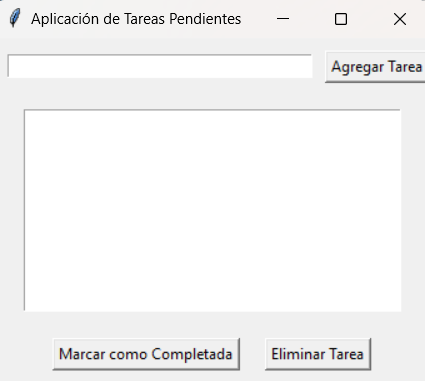

# Aplicación para administrar Tareas

Este repositorio ejecuta un código que despliega una ventana para la administración de tareas.

## Modo de uso

Es necesario tener instalada la biblioteca *tkinter* para utilizar este código. Se ejecuta con el comando `py AplicacionTareas.py clase-7` desde el directorio `.\clase-7`.

## Ejemplo de uso 

